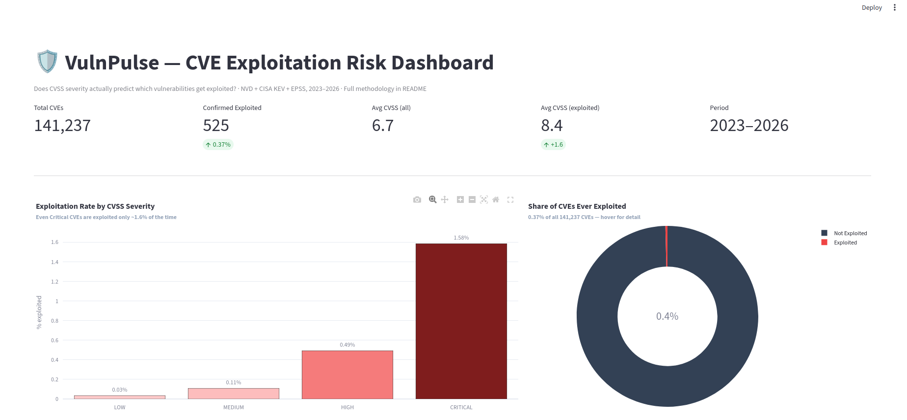
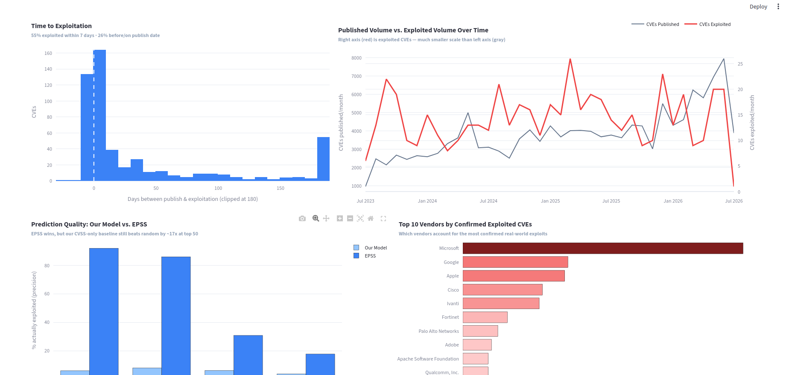
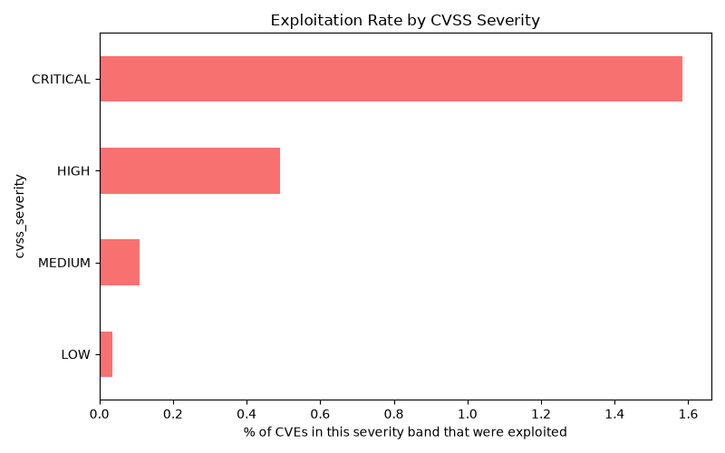
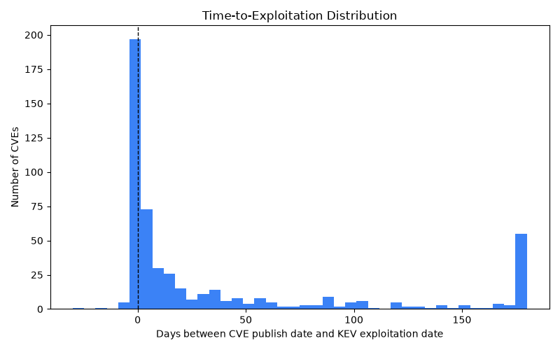

---

  
  
  

---

# VulnPulse — CVE Exploitation Risk Analysis

Does CVSS severity actually predict which vulnerabilities get exploited in the real world?

VulnPulse investigates that question by combining the National Vulnerability Database (NVD) with CISA's Known Exploited Vulnerabilities (KEV) catalog. The project analyses **141,237 CVEs** published between **July 2023 and July 2026**, including **525 confirmed real-world exploitations**, to examine how well CVSS severity reflects actual attacker behaviour.

---

# Dashboard Preview

### Executive Dashboard

### Interactive Analysis

The Streamlit dashboard includes:

- Executive KPI summary
- Exploitation rate by CVSS severity
- Share of vulnerabilities ever exploited
- Time-to-exploitation analysis
- CVE publication vs. exploitation trends
- Baseline machine learning model vs. FIRST EPSS
- Top vendors by confirmed exploited CVEs

---

# Data Sources

This analysis combines three publicly available cybersecurity datasets:

- **[NVD API 2.0](https://nvd.nist.gov/developers/vulnerabilities)** — National Vulnerability Database providing CVE metadata, CVSS scores, affected vendors/products, and publication dates.
- **[CISA Known Exploited Vulnerabilities (KEV)](https://www.cisa.gov/known-exploited-vulnerabilities-catalog)** — CISA's catalogue of vulnerabilities confirmed to have been actively exploited.
- **[FIRST EPSS](https://www.first.org/epss/)** — Daily exploitation probability scores used as the benchmark for model comparison.

---

# Method

The analysis pipeline consists of seven stages:

1. Retrieved all CVEs published over the previous three years using the NVD API (chunked into 120-day windows because of API limits).
2. Cleaned and flattened the NVD JSON structure into a tabular dataset.
3. Selected one consistent CVSS score per CVE, preferring CVSS v3.1 and falling back to CVSS v2 where necessary.
4. Joined NVD data with the CISA KEV catalog using CVE IDs to create the binary **`exploited`** label.
5. Calculated **`days_to_exploit`** (KEV addition date minus NVD publication date) to study exploitation timing.
6. Trained a baseline Logistic Regression model using CVSS metadata.
7. Evaluated ranking performance against FIRST EPSS using Precision@K.

---

# Findings

## 1. Severity ranks risk correctly, but is a weak absolute predictor

Even **CRITICAL** vulnerabilities are exploited only about **1.6%** of the time.

HIGH vulnerabilities are exploited **0.49%** of the time, MEDIUM **0.11%**, and LOW **0.03%**.

The ordering is correct—higher severity generally means higher exploitation risk—but the absolute probabilities remain extremely small. A patching strategy based solely on CVSS severity therefore prioritizes many vulnerabilities that never become active threats.

---

## 2. Speed matters more than severity for many attacks

Among the 525 confirmed exploited CVEs:

- **55%** were exploited within 7 days.
- **69%** within 30 days.
- **82%** within 90 days.

These results highlight how quickly exploitation often follows disclosure and demonstrate the importance of reducing patching delays.

*Values beyond 180 days are grouped into the final bar for readability. The tall bar at the right edge reflects this grouping rather than a genuine spike in attacker activity.*

---

## 3. A significant proportion of exploited vulnerabilities had virtually no warning window

Of the 525 exploited CVEs, **136 (25.9%)** have a negative **`days_to_exploit`**, meaning exploitation was recorded before—or on—the vulnerability's official NVD publication date.

This pattern is consistent with zero-day exploitation, although some negative intervals may result from differences between disclosure dates and NVD publication dates. Regardless of the cause, the proportion is large enough to represent a meaningful operational trend rather than an isolated edge case.

---

# Why This Matters (Related Work)

Predicting exploitation is an active area of cybersecurity research, and VulnPulse is intended to complement—not replace—existing approaches.

- **[FIRST EPSS](https://www.first.org/epss/)** is the industry-standard model for estimating exploitation likelihood. It serves as the benchmark for this project and uses a richer set of signals than CVSS metadata alone.

- **CISA KEV** is not predictive. Instead, it provides a verified list of vulnerabilities known to have been exploited and serves as the ground truth throughout this analysis.

- **Commercial vulnerability management platforms** such as Tenable, Qualys, and Rapid7 incorporate EPSS and KEV into enterprise workflows but package them within proprietary platforms.

Rather than attempting to outperform EPSS, VulnPulse focuses on transparency—demonstrating the relationship between CVSS severity and real-world exploitation using open datasets that anyone can inspect, reproduce, and extend.

---

# Model Results: Baseline Prediction vs. EPSS

Using only CVSS score and its sub-metrics (Attack Vector, Attack Complexity, Privileges Required, and User Interaction), a Logistic Regression model was trained on CVEs published before 2025 and evaluated on CVEs published during 2025–2026.

Performance was measured using **Precision@K**—if a security team could only patch the top-ranked vulnerabilities, how many would actually be exploited?

| Top K | Our Model | EPSS |
|------:|----------:|-----:|
| 50 | 6.0% | 92.0% |
| 100 | 8.0% | 86.0% |
| 500 | 6.2% | 30.8% |
| 1000 | 3.8% | 17.7% |

**Honest interpretation:** EPSS decisively outperforms the baseline model, which is expected because it incorporates richer threat intelligence than CVSS metadata alone. This project intentionally restricts itself to publicly available NVD features to examine how much predictive value can be extracted without external intelligence. Even with that limitation, the baseline still performs substantially better than random prioritization, demonstrating that CVSS sub-metrics contain useful predictive signal beyond the headline severity score.

---

# What This Means in Practice

This analysis suggests that prioritizing vulnerabilities solely by CVSS severity overlooks two important realities:

- Most high-severity vulnerabilities are never exploited.
- Many real attacks occur immediately after disclosure—or even before public publication.

CVSS remains an important indicator, but it should be considered alongside additional risk signals rather than serving as the only basis for patch prioritization.

---

# Next Steps

Future work will focus on expanding both the predictive model and the interactive dashboard.

- Incorporate richer features such as vendor history, product history, CWE categories, and vulnerability description signals.
- Explore ensemble approaches combining CVSS-based features with FIRST EPSS.
- Evaluate additional machine learning models beyond Logistic Regression.
- Expand the Streamlit dashboard with interactive filtering and drill-down analysis.

---

# Technology Stack

Python (requests, pandas, scikit-learn, Plotly, and matplotlib) was used for data collection, preprocessing, machine learning, and visualization. The results are presented through an interactive Streamlit dashboard.

---

# Acknowledgements

This project was built using publicly available datasets provided by:

- National Vulnerability Database (NVD)
- CISA Known Exploited Vulnerabilities (KEV) Catalog
- FIRST Exploit Prediction Scoring System (EPSS)

Their commitment to open cybersecurity data makes projects like this possible.